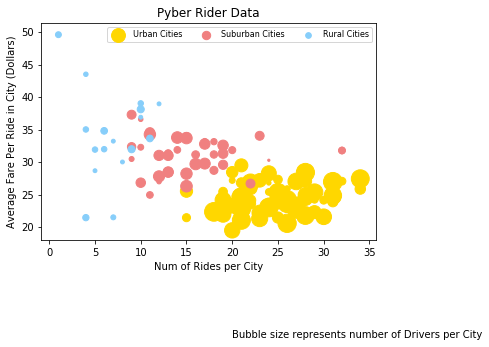
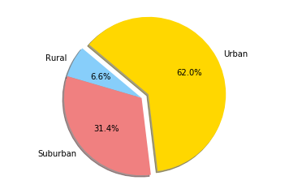
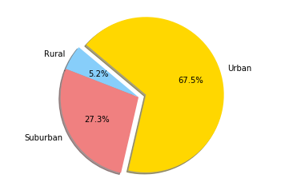
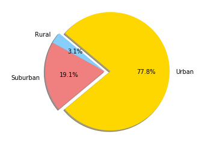

```python
import pandas as pd
import numpy as np 
import matplotlib.pyplot as plt
import numpy as np
import seaborn as sns
#import plotly.plotly as py
```


```python
#Christopher Newbolt
#HW 5: Pyber
```


```python
#Three observed trends
#Observation 1: you can expect some of the highest fares per trip the further you live from the Urban areas
#Observation 2: Urban areas have much more users than none urban areas
#Observation 3: Even though we have much less than than 30% trips total and drivers in rural and suburban areas, 
        #our revenue is almost 40% because the trips are longer than the typical Urban trips
    #There are more drivers in cities as they get bigger
```


```python
#Setting up Original DFs. 
city_df = pd.read_csv("hw_Resources/city_data.csv")
ride_df =pd.read_csv("hw_Resources/ride_data.csv")
ride_df.head()
```


<div>
<style>
    .dataframe thead tr:only-child th {
        text-align: right;
    }

    .dataframe thead th {
        text-align: left;
    }

    .dataframe tbody tr th {
        vertical-align: top;
    }
</style>
<table border="1" class="dataframe">
  <thead>
    <tr style="text-align: right;">
      <th></th>
      <th>city</th>
      <th>date</th>
      <th>fare</th>
      <th>ride_id</th>
    </tr>
  </thead>
  <tbody>
    <tr>
      <th>0</th>
      <td>Sarabury</td>
      <td>2016-01-16 13:49:27</td>
      <td>38.35</td>
      <td>5403689035038</td>
    </tr>
    <tr>
      <th>1</th>
      <td>South Roy</td>
      <td>2016-01-02 18:42:34</td>
      <td>17.49</td>
      <td>4036272335942</td>
    </tr>
    <tr>
      <th>2</th>
      <td>Wiseborough</td>
      <td>2016-01-21 17:35:29</td>
      <td>44.18</td>
      <td>3645042422587</td>
    </tr>
    <tr>
      <th>3</th>
      <td>Spencertown</td>
      <td>2016-07-31 14:53:22</td>
      <td>6.87</td>
      <td>2242596575892</td>
    </tr>
    <tr>
      <th>4</th>
      <td>Nguyenbury</td>
      <td>2016-07-09 04:42:44</td>
      <td>6.28</td>
      <td>1543057793673</td>
    </tr>
  </tbody>
</table>
</div>


```python
city_df.head()
```


<div>
<style>
    .dataframe thead tr:only-child th {
        text-align: right;
    }

    .dataframe thead th {
        text-align: left;
    }

    .dataframe tbody tr th {
        vertical-align: top;
    }
</style>
<table border="1" class="dataframe">
  <thead>
    <tr style="text-align: right;">
      <th></th>
      <th>city</th>
      <th>driver_count</th>
      <th>type</th>
    </tr>
  </thead>
  <tbody>
    <tr>
      <th>0</th>
      <td>Kelseyland</td>
      <td>63</td>
      <td>Urban</td>
    </tr>
    <tr>
      <th>1</th>
      <td>Nguyenbury</td>
      <td>8</td>
      <td>Urban</td>
    </tr>
    <tr>
      <th>2</th>
      <td>East Douglas</td>
      <td>12</td>
      <td>Urban</td>
    </tr>
    <tr>
      <th>3</th>
      <td>West Dawnfurt</td>
      <td>34</td>
      <td>Urban</td>
    </tr>
    <tr>
      <th>4</th>
      <td>Rodriguezburgh</td>
      <td>52</td>
      <td>Urban</td>
    </tr>
  </tbody>
</table>
</div>


```python
#Merging df on cities

pyber_df=pd.merge(ride_df, city_df, how="outer", on="city")
#pyber_df.head()
```


```python
#Eliminating Columns in Reduced DF

pyber_df = pyber_df.iloc[:,[0,2,3,4,5]]
pyber_df.head()
```


<div>
<style>
    .dataframe thead tr:only-child th {
        text-align: right;
    }

    .dataframe thead th {
        text-align: left;
    }

    .dataframe tbody tr th {
        vertical-align: top;
    }
</style>
<table border="1" class="dataframe">
  <thead>
    <tr style="text-align: right;">
      <th></th>
      <th>city</th>
      <th>fare</th>
      <th>ride_id</th>
      <th>driver_count</th>
      <th>type</th>
    </tr>
  </thead>
  <tbody>
    <tr>
      <th>0</th>
      <td>Sarabury</td>
      <td>38.35</td>
      <td>5403689035038</td>
      <td>46</td>
      <td>Urban</td>
    </tr>
    <tr>
      <th>1</th>
      <td>Sarabury</td>
      <td>21.76</td>
      <td>7546681945283</td>
      <td>46</td>
      <td>Urban</td>
    </tr>
    <tr>
      <th>2</th>
      <td>Sarabury</td>
      <td>38.03</td>
      <td>4932495851866</td>
      <td>46</td>
      <td>Urban</td>
    </tr>
    <tr>
      <th>3</th>
      <td>Sarabury</td>
      <td>26.82</td>
      <td>6711035373406</td>
      <td>46</td>
      <td>Urban</td>
    </tr>
    <tr>
      <th>4</th>
      <td>Sarabury</td>
      <td>30.30</td>
      <td>6388737278232</td>
      <td>46</td>
      <td>Urban</td>
    </tr>
  </tbody>
</table>
</div>


```python
#Your objective is to build a Bubble Plot that showcases the 
#    relationship between four key variables:

#COLOR SCHEME GOLD, LIGHT SKY BLUE, AND LIGHT CORAL

#Average Fare ($) Per City          ========= Can calculate from Riders_df
#Total Number of Rides Per City     ========= must calculate from Riders_df
#Total Number of Drivers Per City =========== Given in City_df
#City Type (Urban, Suburban, Rural) ========= Given in City_df
```


```python
#Calculating the Av. Fare/City using the Merged DF (seems like i didn't need a merge)

cpCity = pyber_df[["city","fare"]].groupby("city").mean()
cpCity=cpCity.reset_index()                               # This lines reset the Indexes for Aesthetics
cpCity.style.format({'fare': '${:.2f}'})                  #formats fare for $$$$
cpCity.head()
```


<div>
<style>
    .dataframe thead tr:only-child th {
        text-align: right;
    }

    .dataframe thead th {
        text-align: left;
    }

    .dataframe tbody tr th {
        vertical-align: top;
    }
</style>
<table border="1" class="dataframe">
  <thead>
    <tr style="text-align: right;">
      <th></th>
      <th>city</th>
      <th>fare</th>
    </tr>
  </thead>
  <tbody>
    <tr>
      <th>0</th>
      <td>Alvarezhaven</td>
      <td>23.928710</td>
    </tr>
    <tr>
      <th>1</th>
      <td>Alyssaberg</td>
      <td>20.609615</td>
    </tr>
    <tr>
      <th>2</th>
      <td>Anitamouth</td>
      <td>37.315556</td>
    </tr>
    <tr>
      <th>3</th>
      <td>Antoniomouth</td>
      <td>23.625000</td>
    </tr>
    <tr>
      <th>4</th>
      <td>Aprilchester</td>
      <td>21.981579</td>
    </tr>
  </tbody>
</table>
</div>


```python

TypeCity=city_df.groupby("type").count()
TypeCity=TypeCity.reset_index()
TypeCity.head()
```


<div>
<style>
    .dataframe thead tr:only-child th {
        text-align: right;
    }

    .dataframe thead th {
        text-align: left;
    }

    .dataframe tbody tr th {
        vertical-align: top;
    }
</style>
<table border="1" class="dataframe">
  <thead>
    <tr style="text-align: right;">
      <th></th>
      <th>type</th>
      <th>city</th>
      <th>driver_count</th>
    </tr>
  </thead>
  <tbody>
    <tr>
      <th>0</th>
      <td>Rural</td>
      <td>18</td>
      <td>18</td>
    </tr>
    <tr>
      <th>1</th>
      <td>Suburban</td>
      <td>42</td>
      <td>42</td>
    </tr>
    <tr>
      <th>2</th>
      <td>Urban</td>
      <td>66</td>
      <td>66</td>
    </tr>
  </tbody>
</table>
</div>


```python
#Not needed
#found driver per cit on combined....

DpC= pyber_df[["city","driver_count"]].groupby("city").mean()
DpC = DpC.rename(columns={"driver_count":"# of Drivers Per City"})
DpC=DpC.reset_index()
#DpC.head()
```


```python
#Calculate total riders using Ride_df

TotRiders=ride_df[["city","ride_id"]].groupby("city").count()
#TotRiders = TotRiders.sort_values(["city"], ascending=True)
TotRiders = TotRiders.rename(columns={"ride_id":"# of Riders Per City"})
TotRiders=TotRiders.reset_index()
TotRiders.head()
```


<div>
<style>
    .dataframe thead tr:only-child th {
        text-align: right;
    }

    .dataframe thead th {
        text-align: left;
    }

    .dataframe tbody tr th {
        vertical-align: top;
    }
</style>
<table border="1" class="dataframe">
  <thead>
    <tr style="text-align: right;">
      <th></th>
      <th>city</th>
      <th># of Riders Per City</th>
    </tr>
  </thead>
  <tbody>
    <tr>
      <th>0</th>
      <td>Alvarezhaven</td>
      <td>31</td>
    </tr>
    <tr>
      <th>1</th>
      <td>Alyssaberg</td>
      <td>26</td>
    </tr>
    <tr>
      <th>2</th>
      <td>Anitamouth</td>
      <td>9</td>
    </tr>
    <tr>
      <th>3</th>
      <td>Antoniomouth</td>
      <td>22</td>
    </tr>
    <tr>
      <th>4</th>
      <td>Aprilchester</td>
      <td>19</td>
    </tr>
  </tbody>
</table>
</div>


```python
#I need a merge to build final dF:

#Average Fare ($) Per City          ========= cpCity
#Total Number of Rides Per City     ========= TotRiders
#Total Number of Drivers Per City =========== DpC
#City Type (Urban, Suburban, Rural) ========= city_df


merged_pyber = pd.merge(cpCity, TotRiders, how="outer", on="city")
merged_pyber = pd.merge(merged_pyber, DpC, how="outer", on="city")
merged_pyber = pd.merge(merged_pyber, city_df, how="outer", on="city")
merged_pyber = merged_pyber.iloc[:,[0,1,2,3,5]]
merged_pyber.head()


```


<div>
<style>
    .dataframe thead tr:only-child th {
        text-align: right;
    }

    .dataframe thead th {
        text-align: left;
    }

    .dataframe tbody tr th {
        vertical-align: top;
    }
</style>
<table border="1" class="dataframe">
  <thead>
    <tr style="text-align: right;">
      <th></th>
      <th>city</th>
      <th>fare</th>
      <th># of Riders Per City</th>
      <th># of Drivers Per City</th>
      <th>type</th>
    </tr>
  </thead>
  <tbody>
    <tr>
      <th>0</th>
      <td>Alvarezhaven</td>
      <td>23.928710</td>
      <td>31</td>
      <td>21</td>
      <td>Urban</td>
    </tr>
    <tr>
      <th>1</th>
      <td>Alyssaberg</td>
      <td>20.609615</td>
      <td>26</td>
      <td>67</td>
      <td>Urban</td>
    </tr>
    <tr>
      <th>2</th>
      <td>Anitamouth</td>
      <td>37.315556</td>
      <td>9</td>
      <td>16</td>
      <td>Suburban</td>
    </tr>
    <tr>
      <th>3</th>
      <td>Antoniomouth</td>
      <td>23.625000</td>
      <td>22</td>
      <td>21</td>
      <td>Urban</td>
    </tr>
    <tr>
      <th>4</th>
      <td>Aprilchester</td>
      <td>21.981579</td>
      <td>19</td>
      <td>49</td>
      <td>Urban</td>
    </tr>
  </tbody>
</table>
</div>


```python
#Create df for each type of city so i can plot each in its own color
#GOLD, LIGHT SKY BLUE, AND LIGHT CORAL


urban_df = merged_pyber.loc[merged_pyber["type"] == "Urban"]
suburban_df = merged_pyber.loc[merged_pyber["type"] == "Suburban"]
rural_df= merged_pyber.loc[merged_pyber["type"] == "Rural"]
#urban_df.head()
```


```python
#Create the scatter plot of each df and then plot it with the chart properties


a=plt.scatter(urban_df['# of Riders Per City'], urban_df['fare'],s= urban_df['# of Drivers Per City']*5, c='gold')
b=plt.scatter(suburban_df['# of Riders Per City'], suburban_df['fare'],s= suburban_df['# of Drivers Per City']*5, c='lightcoral')
c=plt.scatter(rural_df['# of Riders Per City'], rural_df['fare'],s= rural_df['# of Drivers Per City']*5, c='lightskyblue')
plt.title("Pyber Rider Data")
plt.xlabel("Num of Rides per City")
plt.ylabel("Average Fare Per Ride in City (Dollars)")

plt.legend((a, b, c), ('Urban Cities', 'Suburban Cities', 'Rural Cities'), scatterpoints=1,
            loc='upper right',
            ncol=3,
            fontsize=8)

plt.annotate('Bubble size represents number of Drivers per City', xy=(35, 40), xytext=(20, 3),)  # Adding note about hte third dataset

plt.show()

```





```python
#In addition, you will be expected to produce the following 
    #three pie charts:
    
#COLOR SCHEME GOLD, LIGHT SKY BLUE, AND LIGHT CORAL

#'% of Total Fares by City Type
#'% of Total Rides by City Type
#'% of Total Drivers by City Type
```


```python
#========================================================================
#Total fare per city
#========================================================================

fareTSum= pyber_df[["type","fare"]].groupby("type").sum()
fareTSum=fareTSum.reset_index()
fareTSum
```


<div>
<style>
    .dataframe thead tr:only-child th {
        text-align: right;
    }

    .dataframe thead th {
        text-align: left;
    }

    .dataframe tbody tr th {
        vertical-align: top;
    }
</style>
<table border="1" class="dataframe">
  <thead>
    <tr style="text-align: right;">
      <th></th>
      <th>type</th>
      <th>fare</th>
    </tr>
  </thead>
  <tbody>
    <tr>
      <th>0</th>
      <td>Rural</td>
      <td>4255.09</td>
    </tr>
    <tr>
      <th>1</th>
      <td>Suburban</td>
      <td>20335.69</td>
    </tr>
    <tr>
      <th>2</th>
      <td>Urban</td>
      <td>40078.34</td>
    </tr>
  </tbody>
</table>
</div>


```python
#========================================================================
#Total fare calculation from original data
#========================================================================

totalFare=ride_df["fare"].sum()
totalFare
```


    63651.30999999986


```python
#Adding a Percentage Column to the df needed for the pie chart
fareTSum['Percentage']=(fareTSum['fare']/totalFare*100)
#fareTSum

```


```python
#'% of Total Fares by City Type


labels = fareTSum['type']                                     # Labels for the sections of our pie chart
sizes = fareTSum['Percentage']                                 # The values of each section of the pie chart                            
colors = ["lightskyblue", "lightcoral", "Gold"]                # The colors of each section of the pie chart
explode = (0, 0, 0.1)                                          # Tells matplotlib to seperate the "Python" section from the others                                 
plt.pie(sizes, explode=explode, labels=labels, colors=colors,
        autopct="%1.1f%%", shadow=True, startangle=140)
plt.axis("equal")                                               # Tells matplotlib that we want a pie chart with equal axes
plt.show()                                                      # Prints our pie chart to the screen
```





```python
#========================================================================
#Total fare calculation from dataframe that seperates fare total by city type
#========================================================================


totalFare2=fareTSum["fare"].sum()

totalFare2
```


    64669.11999999997


```python
#========================================================================
#Rides sum per City Type
#========================================================================


ridesTSum= pyber_df[["type","fare"]].groupby("type").count()
ridesTSum=ridesTSum.reset_index()
ridesTSum
```


<div>
<style>
    .dataframe thead tr:only-child th {
        text-align: right;
    }

    .dataframe thead th {
        text-align: left;
    }

    .dataframe tbody tr th {
        vertical-align: top;
    }
</style>
<table border="1" class="dataframe">
  <thead>
    <tr style="text-align: right;">
      <th></th>
      <th>type</th>
      <th>fare</th>
    </tr>
  </thead>
  <tbody>
    <tr>
      <th>0</th>
      <td>Rural</td>
      <td>125</td>
    </tr>
    <tr>
      <th>1</th>
      <td>Suburban</td>
      <td>657</td>
    </tr>
    <tr>
      <th>2</th>
      <td>Urban</td>
      <td>1625</td>
    </tr>
  </tbody>
</table>
</div>


```python
#Adding a Percentage Column to the df needed for the pie chart
totRide=ride_df["fare"].count()                                    #Calculating the total number of rides
ridesTSum['Percentage']=(ridesTSum['fare']/totRide*100)
ridesTSum
```


<div>
<style>
    .dataframe thead tr:only-child th {
        text-align: right;
    }

    .dataframe thead th {
        text-align: left;
    }

    .dataframe tbody tr th {
        vertical-align: top;
    }
</style>
<table border="1" class="dataframe">
  <thead>
    <tr style="text-align: right;">
      <th></th>
      <th>type</th>
      <th>fare</th>
      <th>Percentage</th>
    </tr>
  </thead>
  <tbody>
    <tr>
      <th>0</th>
      <td>Rural</td>
      <td>125</td>
      <td>5.263158</td>
    </tr>
    <tr>
      <th>1</th>
      <td>Suburban</td>
      <td>657</td>
      <td>27.663158</td>
    </tr>
    <tr>
      <th>2</th>
      <td>Urban</td>
      <td>1625</td>
      <td>68.421053</td>
    </tr>
  </tbody>
</table>
</div>


```python
#'Ride Sum per city


labels = ridesTSum['type']                                     # Labels for the sections of our pie chart
sizes = ridesTSum['Percentage']                                 # The values of each section of the pie chart                            
colors = ["lightskyblue", "lightcoral", "Gold"]                # The colors of each section of the pie chart
explode = (0, 0, 0.1)                                          # Tells matplotlib to seperate the "Python" section from the others                                 
plt.pie(sizes, explode=explode, labels=labels, colors=colors,
        autopct="%1.1f%%", shadow=True, startangle=140)
plt.axis("equal")                                               # Tells matplotlib that we want a pie chart with equal axes
plt.show()                                                      # Prints our pie chart to the screen
```





```python
#========================================================================
#Driver sums per City Type
#========================================================================

driverTSum= city_df[["type","driver_count"]].groupby("type").sum()
driverTSum=driverTSum.reset_index()
driverTSum
```


<div>
<style>
    .dataframe thead tr:only-child th {
        text-align: right;
    }

    .dataframe thead th {
        text-align: left;
    }

    .dataframe tbody tr th {
        vertical-align: top;
    }
</style>
<table border="1" class="dataframe">
  <thead>
    <tr style="text-align: right;">
      <th></th>
      <th>type</th>
      <th>driver_count</th>
    </tr>
  </thead>
  <tbody>
    <tr>
      <th>0</th>
      <td>Rural</td>
      <td>104</td>
    </tr>
    <tr>
      <th>1</th>
      <td>Suburban</td>
      <td>638</td>
    </tr>
    <tr>
      <th>2</th>
      <td>Urban</td>
      <td>2607</td>
    </tr>
  </tbody>
</table>
</div>


```python
totDriver=city_df["driver_count"].sum()                                    #Calculating the total number of driversides
driverTSum['Percentage']=(driverTSum['driver_count']/totDriver*100)
driverTSum
```


<div>
<style>
    .dataframe thead tr:only-child th {
        text-align: right;
    }

    .dataframe thead th {
        text-align: left;
    }

    .dataframe tbody tr th {
        vertical-align: top;
    }
</style>
<table border="1" class="dataframe">
  <thead>
    <tr style="text-align: right;">
      <th></th>
      <th>type</th>
      <th>driver_count</th>
      <th>Percentage</th>
    </tr>
  </thead>
  <tbody>
    <tr>
      <th>0</th>
      <td>Rural</td>
      <td>104</td>
      <td>3.105405</td>
    </tr>
    <tr>
      <th>1</th>
      <td>Suburban</td>
      <td>638</td>
      <td>19.050463</td>
    </tr>
    <tr>
      <th>2</th>
      <td>Urban</td>
      <td>2607</td>
      <td>77.844133</td>
    </tr>
  </tbody>
</table>
</div>


```python
#'% of Total Drivers by City Type


labels = driverTSum['type']                                     # Labels for the sections of our pie chart
sizes = driverTSum['Percentage']                                 # The values of each section of the pie chart                            
colors = ["lightskyblue", "lightcoral", "Gold"]                # The colors of each section of the pie chart
explode = (0, 0, 0.1)                                          # Tells matplotlib to seperate the "Python" section from the others                                 
plt.pie(sizes, explode=explode, labels=labels, colors=colors,
        autopct="%1.1f%%", shadow=True, startangle=140)
plt.axis("equal")                                               # Tells matplotlib that we want a pie chart with equal axes
plt.show()                                                      # Prints our pie chart to the screen
```





```python
#Christopher Newbolt
#HW 5: Pyber
```
